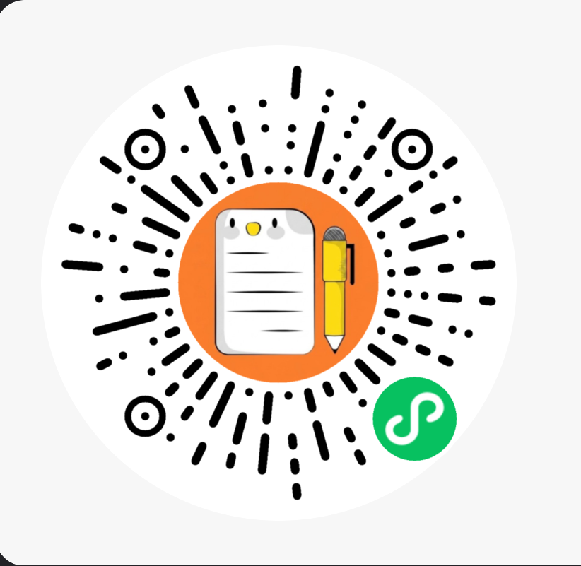

<p align="center">
  
</p>

# Memo Calendar (备忘录日历)

> 📅 **极致拟物手账美学，丝滑流畅的日程规划小程序**

`Memo Calendar` 是一款专为高效日程管理设计的微信小程序。应用采用 **Apple Notes 拟物纸质美学** 设计风格，打破了传统日历工具生硬死板的条框感，为用户提供有如物理手账般温润、雅致的使用体验。

---

## ✨ 核心特性迭代

经过多个版本的递进优化，小程序现已搭载以下核心特性：

### 1. 🎨 活力橙橘与极简手账美学
* **视觉设计**：采用纯净高对比的**原生纯白色背景**（`#ffffff`），搭配精致的扁平圆角卡片，配合亮丽温暖的**活力橙橘主题色**（`#fa8231`），还原最本真、有生活感的手账质感。
* **原生极简弹窗**：采用原生 `wx.showModal` 实现确认交互，保持与微信生态的高度一致性，界面干净利落，符合极简设计美学。
* **二级防遮挡定位**：新建分类等二级弹窗支持键盘唤起时自动向上偏移（`240rpx`），配合顶层 `z-index` 级联，完美躲避系统软键盘覆盖。

### 2. ⚡ 极速冷启动与高并发性能调优 (双线程深度调优)
* **逻辑层数据与视图层彻底解耦**：将全量日程数据 `memoDates` 移出响应式的 Page `data`，改为普通页面实例属性，从根本上杜绝了每次日程操作时整包大数据的序列化拷贝开销。
* **首屏单次渲染闭环**：通过 `Promise.all` 并行异步读取 memos 与 custom categories。将日程、标记、分类在一次 `setData` 流程中整包输出，将启动渲染回流由 3 次精简为 1 次，消除了加载过程中的视觉抖动。
* **全量标记分片异步构建**：首屏仅同步绘制当前日期状态；其余日期标记点采用 60 天为一个批次，在回调中通过 `setTimeout` 分片异步延时（400ms）生成，并加入防竞态 token 锁，实现 100% 页面冷启动零卡顿（主线程脚本执行耗时降至 15ms 内，微信性能评测 A 级满分）。
* **静态文案与高频分配调优**：页面、日历组件统一复用集中式多语言字典，并为缺失字段提供中文回退；日历标记构建算法扁平化，用简单 `for` 循环替代 `map`/`Set` 临时对象，减少高频临时对象分配。

### 3. 🏂 物理手势与视差回弹动效
* **40ms 渐进视差侧滑**：日程卡片支持左滑“完成”与“删除”药丸按钮。利用 CSS 动画延时（`transition-delay`），呈现出 **40ms 错落视差回弹效果**，回弹手感丝滑。
* **左滑自动复位**：操作按钮展开 3 秒后自动收起，再次左滑会重新计时；切换日期、拖拽或执行日程操作时会立即清理计时器。
* **长按拖拽物理重排**：在单日日程列表内，长按卡片即可上下拖拽重排顺序。每次排序位移均伴随**物理马达震动反馈 (`wx.vibrateShort`)**，拖拽动作平滑，完美适配真机手感。

### 4. 🛡️ 物理级防爆字数硬性拦截
* **输入零延迟**：表单输入（标题、地点、备注、新分类名）在打字期间采用**逻辑层直接突变赋值**，规避双线程高频 `setData` 序列化传输，打字如行云流水。
* **实时字数硬拦截**：使用底层原生 `maxlength` 属性。字数达到上限时直接物理锁死输入法，不等到点击保存时才报错：
  * **分类名称**：最多 10 字（占位符提示）
  * **日程标题**：最多 40 字（占位符提示，且带实时字符计数器）
  * **行程地点**：最多 100 字（占位符提示）
  * **详细备注**：最多 200 字（实时字数计数器 `memoNotesLength` 独立渲染更新）

### 5. 💾 离线防污染数据备份与自动化单元测试
* **剪贴板智能恢复**：支持一键剪贴板 JSON 读取与解析，提供合并导入（追加）与覆盖导入（替换）双模式。
* **严密的归一化校验**：解析时对导入字段进行彻底的过滤、长度截断以及 Hex 颜色安全正则判定，分类丢失自动退化默认类别，全面防范存储溢出。
* **自动化单元测试**：测试覆盖数据解码、字段裁剪、冲突合并、分类去重、日期边界、国际化回退及日程写入并发锁。

### 6. 🛠️ 稳定性与体验补强
* **弹窗底层滚动锁**：结合微信原生 `<page-meta>`，当日程表单、新建分类等任一覆盖层激活时，物理锁死底层 WebView 滚动，彻底消除 iOS 弹性橡皮筋穿透问题。
* **健壮的弹窗回调**：在使用确认弹窗时，结合 `try...finally` 等安全块捕获并拦截回调错误，杜绝在复杂异常分支下的内存死锁。
* **防双击防并发**：日程保存流程引入 `savingMemo` 物理状态锁，杜绝由于手快狂点导致创建出重复重复日程的问题。
* **原生年月滚轮**：日历表头接入微信原生年月选择器，支持快速跳转月份，并与左右翻月保持同一套日期状态。
* **严格日期校验**：通过 JS Date 逆向对齐检验，拒绝如 `2026-99-99` 等脏数据参数进入状态，拦截页面闪退隐患。

### 7. 👥 好友日程分享与 Canvas 预览卡片 (Share Feature)
* **动态 Canvas 离屏绘图**：点击卡片内“分享”按钮时，利用后台隐藏 Canvas（500px * 400px）动态绘制周历网格。高亮显示日程当天，标识周历小点，并绘制日程标题、时间、地点、分类图标等详细元数据。
* **1.8秒超时熔断机制**：为 Canvas 图片生成配备 1800ms 物理超时锁。若生成超时，则优雅回退为普通文字卡片形式，防止在老旧真机上造成显示阻塞。
* **LRU 缓存管理**：维护一个上限为 12 层的最久未使用（LRU）缓存，支持使用顺序动态刷新，并在页面卸载（`onUnload`）时自动清除释放内存。
* **智能查重与幂等保存**：扫码或点击分享链接进入时，支持预览弹窗展示。根据本地数据状态，智能识别三种保存状态：**全新（new）**、**内容有异（changed，提供替换更新）**、**完全相同（unchanged，提示已保存并自动隐藏保存按钮）**。支持当天快速比对，提升查询性能。
* **安全链接校验**：通过 Base64 算法对分享日程数据进行高比例无损压缩编码，严格限制分享链接在 2048 字符内，规避微信分享路径截断。

### 8. 🎯 快捷边框勾选交互 (Border Click Toggle)
* **隐藏式极简交互**：突破了传统待办应用在卡片内部放置圆圈的陈旧设计，将日程完成/待办状态的切换区域直接与卡片左侧的彩色分类竖线整合，维持卡片文本原版纯粹的极简呼吸感。
* **高灵敏度触控热区**：利用绝对定位的透明点击层置于卡片 Wrapper 外层（避开 `overflow: hidden` 的裁剪限制），将实际触控宽度向右隐式扩展至 `68rpx`（彩色边框 `8rpx` + 内侧 `60rpx`），实现盲操级别的精准触控。
* **滑动冲突防误触**：左滑展开操作按钮（分享、删除）时，热区会自动隐藏（`display: none`），确保用户在操作滑动按钮时绝不会发生误触，手势分流极为精准。
* **底层重构统一收拢**：将点击彩色条和左滑完成动作的底层逻辑统一收拢于 `onMemoCompletedTap`，消除多余中转委托函数，实现架构的极简化。

---

## 📁 项目结构

```bash
├── components/          # 自定义组件
│   └── calendar/        # 核心手风琴折叠日历组件 (包含周/月视图计算)
├── pages/
│   └── index/           # 主手账日历页面 (包含拖拽、侧滑、多弹窗交互)
│       ├── constants.js # 集中共享常量 (STORAGE_KEYS, DEFAULT_FORM 等)
│       ├── index.js     # 控制器核心框架 (核心生命周期、存储加载与路由绑定)
│       ├── gestureHandlers.js # 手势操作处理器 (侧滑操作与拖拽重排逻辑)
│       ├── formHandlers.js    # 表单与自定义分类处理器 (模态框交互逻辑)
│       ├── backupHandlers.js  # 数据备份与恢复处理器 (导入导出与防覆盖保护)
│       ├── index.wxml   # 极简手账排版结构
│       └── index.wxss   # 活力橙橘质感样式与弹性动画定义
├── tests/               # 自动化单元测试目录 (本地开发测试，打包上传时自动忽略)
│   ├── backup.test.js   # 备份与合并底层算法单元测试
│   ├── backup-handlers.test.js # 页面备份与还原交互逻辑测试
│   ├── calendar.test.js  # 日历组件核心算法与行数状态机测试
│   ├── categories.test.js # 分类创建与配色循环算法测试
│   ├── date.test.js     # 日期格式化与合法性校验测试
│   ├── drag-handlers.test.js # 拖拽排序逻辑单元测试
│   ├── form-handlers.test.js # 日程表单保存与异步并发覆盖守护测试
│   ├── i18n.test.js     # 国际化字典完整性与回退测试
│   ├── memos.test.js    # 日程数据清洗与非突变行为测试
│   ├── share.test.js    # 好友日程分享逻辑单元测试
│   └── swipe-actions.test.js # 左滑完成/删除手势操作与系统中断捕获测试
├── utils/
│   ├── backup.js        # 备份导出/解析归一化及合并核心算法
│   ├── categories.js    # 内置与自定义分类域模型、色板及创建工厂
│   ├── date.js          # 日期格式化、解析与合法性校验
│   ├── i18n.js          # 集中式多语言字典 (支持中英一键切换)
│   └── memos.js         # 日程数据清洗与 UI 临时字段移除
├── app.js               # 小程序入口
├── app.json             # 路由与全局窗口配置
├── project.config.json  # 微信开发者工具编译配置
└── README.md            # 说明文档
```

---

## 💾 数据备份与恢复 (Data Backup & Restore)

小程序提供了完全本地化、隐私安全的**日程数据导入与导出**功能（可在小程序右上角点击 **“备份”** 按钮唤起面板）。

### 1. 备份数据格式说明
备份数据采用标准的 JSON 格式，包含安全的应用程序识别指纹与完整字段校验。手动编辑或导入的 JSON 字符串结构如下：

```json
{
  "version": 1,
  "app": "MemoCalendar",
  "exportAt": "2026-07-04T09:14:00.000Z",
  "memos": {
    "2026-07-04": [
      {
        "id": "memo-20260704-182500123-456",
        "title": "学习小程序开发",
        "time": "14:30",
        "location": "图书馆",
        "tag": "custom-20260704-181046377",
        "color": "#34c759",
        "notes": "阅读日程数据导入导出章节",
        "completed": false
      }
    ]
  },
  "categories": [
    {
      "key": "custom-20260704-181046377",
      "labelCn": "设计",
      "labelEn": "Design",
      "color": "#34c759",
      "icon": "🏷️"
    }
  ]
}
```

### 2. 字段规范说明

* **核心指纹 (必填)**：
  - `"app"`: 必须为固定的 `"MemoCalendar"`。导入模块会校验该指纹，非本应用的数据会被拒绝，防止数据污染。
* **日程列表 (`"memos"`)**：
  - 以日期 `"YYYY-MM-DD"` 为 Key，对应的值是当天日程的数组。
  - `id` (必填): 最长 80 字符，并且在整份备份中必须全局唯一。系统采用 `memo-时间戳-随机字符` 命名格式。
  - `title` (必填): 日程标题（限制 40 字内）。
  - `tag` (必填): 分类 Key（如 `Work`, `Life`, `Sport`, `Study`, `Important` 或自定义的 `custom-xxx`）。
  - `completed` (必填): 是否已完成（布尔值 `true`/`false`）。
  - `time`, `location`, `notes` (选填): 包含相应的长度防爆校验。
* **自定义分类列表 (`"categories"`)**：
  - 存放用户自定义的分类项。
  - `key` (必填): 必须以 `"custom-"` 开头。系统采用 `custom-时间戳` 命名格式以兼顾唯一性与轻量化。
  - `labelCn` / `labelEn` (必填): 中英文显示名（限制 10 字内）。
  - `color`: Hex 颜色代码（如 `"#34c759"`）。
  - `icon` (选填): Emoji 图标，导入时最多保留 8 个 Unicode 字符。
* **导入安全上限**：
  - 备份 JSON 文本最大 2 MiB。
  - 最多包含 200 个自定义分类、3660 个日期和 10000 条日程；单个日期最多 500 条日程。

### 3. 操作指引

- **导出数据**：点击 **“复制备份数据”**，系统会将整包数据打包为 JSON 字符串并复制到剪贴板，可粘贴发送到微信聊天记录或保存到云端备忘录中。
- **一键导入**：如果在剪贴板中已复制了有效的备份数据，打开面板点击 **“一键从剪贴板读取并导入”** 即可自动识别并注入。
- **合并导入 (追加模式)**：将备份数据中的日程与本地现有日程合并，相同 ID 的日程会被更新，其余日程和自定义分类会安全地追加，**不会覆盖本地已存的数据**。
- **覆盖导入 (替换模式)**：清空本地当前的全部缓存，100% 替换为备份数据中的内容（此操作危险，会触发弹窗警告）。

---

## 🚀 快速开始

可以使用微信开发者工具打开本项目：

1. 打开微信开发者工具，选择 **导入项目**。
2. 选择本项目的根目录。
3. 工具会自动读取 `project.config.json` 中的配置。
4. 在模拟器或真机中预览并测试这款极具质感的小程序！

---

## 🔒 版权与许可

Copyright © 2026 Jesencloud. All Rights Reserved.

本项目为专有软件，仅供查看。未经版权人事先书面授权，任何个人或组织均不得复制、使用、修改、编译、部署、发布、分发、再许可、销售本项目的任何内容，也不得基于本项目创作衍生作品。详情请参阅 [LICENSE](./LICENSE)。

---

## 📱 关注

扫码关注，获取项目相关动态：

<p align="center">
  
</p>
